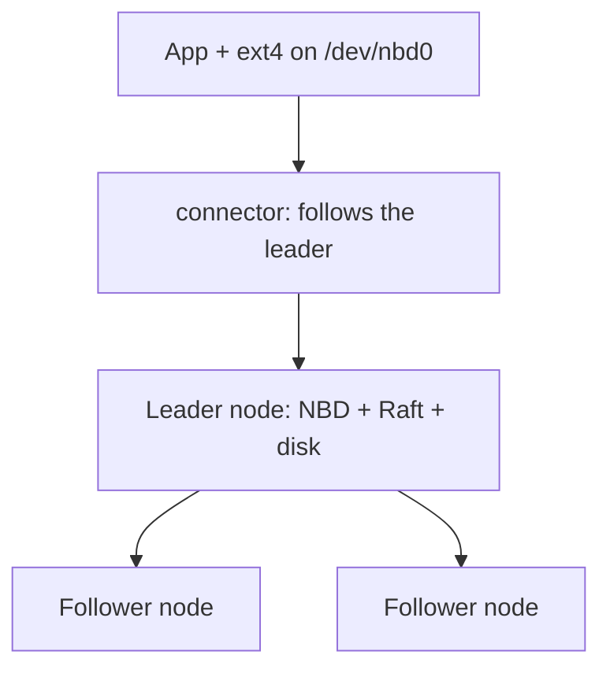

<div align="center">

# VDRSD — Virtual Distributed Replicated Storage Device

**A quorum-replicated virtual disk for lightweight Kubernetes clusters.**
*One C++ binary. Three nodes. Zero lost writes.*


</div>

---

## Table of Contents

- [What it is](#what-it-is)
- [Features](#features)
- [Architecture](#architecture)
- [Quickstart](#quickstart)
- [Usage (`vdrctl`)](#usage-vdrctl)
- [Configuration reference](#configuration-reference)
- [Testing](#testing)
- [Project structure](#project-structure)
- [How replication works](#how-replication-works)
- [Known limitations](#known-limitations)
- [Roadmap](#roadmap)
- [Documentation index](#documentation-index)
- [Contributing](#contributing)

---

## What it is

VDRSD presents a **single virtual hard disk** (`/dev/nbd0`) to applications
while synchronously replicating every 4 KiB block across **three nodes** using
the Raft consensus algorithm. A write is acknowledged only after a majority of
nodes has committed it — kill any one node and the disk keeps serving; restart
it and it catches up on its own. No SAN, no custom kernel module, no external
database: one C++17 daemon (`vdrd`), the stock Linux NBD driver, and the nuRaft
library, shipped as Docker images with Kubernetes manifests.



---

## Features

| Feature | Detail |
|---|---|
| Real block device | `mkfs.ext4`, `mount`, `fio` work unmodified on `/dev/nbd0` |
| Synchronous replication | 1 Raft log per 4 KiB block; ACK only after quorum commit (RPO=0) |
| Automatic failover | Leader re-elected in seconds; clients re-pointed automatically |
| Self-healing rejoin | Restarted nodes replay WAL + pull the missed delta, unaided |
| Data integrity | Per-payload checksums verified on every commit; failures return EIO, never ACK |
| Linearizable I/O | Leader-only reads/writes; followers refuse connections |
| Observable | Plain-text `/leader`, `/health`, `/metrics` on every node |
| One-command lifecycle | `./vdrctl up/test/failover/down` — the whole demo in one tool |
| Small | ~2.5 kLOC of project code plus the nuRaft library |

---

## Architecture

Three identical `vdrd` processes; the only asymmetry is who won the last
election. See [§2 of the Technical Documentation](VDRSD-Technical-Documentation.md#2-system-architecture)
for sequence diagrams, the class diagram, and the fault-tolerance flows.

- **Frontend:** NBD fixed-newstyle server (`src/nbd_server.h`) + stock
  `nbd-client` on the app side. No out-of-tree kernel code.
- **Consensus:** nuRaft with a file-backed log store (`raft.wal`) and a
  block-applying state machine; static 3-member config, no discovery service.
- **Store:** sparse `data.blk` file, `pread`/`pwrite`, fsync on every commit.
- **Ops:** `vdr-connector` sidecar tracks the leader; K3s runs a StatefulSet
  (×3, 10 Gi PVC each), a connector DaemonSet, and a NetworkPolicy.

---

## Quickstart

Prerequisites: Linux, Docker 24+ with the compose plugin, `modprobe nbd`.
(Fedora notes, incl. SELinux bind-mount relabeling, are in
[DEVELOPMENT.md](DEVELOPMENT.md#1-prereqs).)

```bash
git clone https://github.com/Amishapatel05/VDRSD-capstone.git
cd VDRSD-capstone

./vdrctl up          # builds images, starts node-0/1/2, waits for election
./vdrctl status      # leader, metrics, and identical replica hashes
```

Prefer step-by-step with plain-language explanations? Run `./vdrctl menu`.

Native build without Docker:

```bash
cmake -B build -DVDR_WITH_NURAFT=ON && cmake --build build -j
ctest --test-dir build -V     # 13/13 (11 upstream nuRaft + 2 self-checks)
```

---

## Usage (`vdrctl`)

`./vdrctl` is the project's front door — every command explains itself as it runs:

| Command | What it does |
|---|---|
| `./vdrctl up` | Build images, start the cluster, wait for a leader |
| `./vdrctl status` | Dashboard: nodes, leader, metrics, replica-hash equality |
| `./vdrctl test all` | Full gate chain: unit + replication + rolling kill + NBD quorum |
| `./vdrctl test unit` | Native build + `ctest` only (no Docker needed) |
| `./vdrctl failover` | Kill the leader, verify re-election, verify convergence |
| `./vdrctl bench` | `fio` benchmark into `bench/` (needs `fio` + `/dev/nbd`) |
| `./vdrctl logs [node]` | Follow logs |
| `./vdrctl down [-v]` | Stop (`-v` also deletes stored data) |
| `./vdrctl menu` | Interactive mode with descriptions |

Try the headline demo any time:

```bash
./vdrctl failover
```

---

## Configuration reference

`vdrd` flags (also see `./build/vdrd --help`):

| Flag | Default | Meaning |
|---|---|---|
| `--id` | `1` | Raft member ID (1–3) |
| `--peers` | — | Static membership, `id@host:port,…` (required with raft) |
| `--data-dir` | `/data` | Holds `data.blk`, `raft.wal`, `commit.idx`, `cluster.conf`, `srv_state.bin` |
| `--serve` | off | Export the NBD device (blocks until terminated) |
| `--blocks` | `1048576` | Export size in 4 KiB blocks (sparse — unwritten blocks cost nothing) |
| `--selftest N` | `0` | Leader appends N patterned blocks at startup, keeps serving |
| `--nbd-port` / `--raft-port` / `--mgmt-port` | `10809` / `50051` / `50052` | Listen ports |

Environment knobs: `MGMT` (comma-separated mgmt endpoints for tests),
`NBD_DEV` (default `/dev/nbd0`), `BLOCKS` / `SELFTEST` (K3s entry wrapper).

---

## Testing

| Layer | Command | Gate |
|---|---|---|
| Unit (no Docker) | `./vdrctl test unit` | `block_store_demo` + `nbd_demo` assert binaries via `ctest` |
| Replication | `./tests/replication.sh` | Leader self-test + live leader + identical sha256 ×3 |
| Rolling kill | `./tests/kill_leader.sh` | Each node killed/restarted; leader re-elected every round |
| NBD quorum | `./tests/nbd_quorum.sh` | 1 MiB through leader NBD, byte-compared, quorum sha (needs `/dev/nbd`) |
| Benchmark | `./tests/fio_bench.sh` | 4K rand R/W + 64K seq into `bench/` (needs `fio`) |

Full method, real run transcripts, and results: [BENCH.md](BENCH.md) and
[Technical Documentation §9–§10](VDRSD-Technical-Documentation.md#9-testing).

---

## Project structure

```text
VDRSD-capstone/
├── vdrctl                 # CLI: up/status/test/failover/bench/logs/down/menu
├── CMakeLists.txt         # C++17, VDR_WITH_NURAFT option, ctest wiring
├── Dockerfile.vdrd        # multi-stage (RAFT=ON build-arg) + k8s entry tools
├── Dockerfile.connector   # alpine + nbd-client + connect.sh
├── docker-compose.yml     # node-0/1/2: NBD 10809-11, raft 50051-53, mgmt 15052-54
├── src/
│   ├── main.cpp           # flags, startup, wiring (thin by design)
│   ├── block_store.h      # sparse 4K file store
│   ├── nbd_server.h       # fixed-newstyle NBD + leader gate + quorum writes
│   ├── mgmt_http.h        # /leader /health /metrics (plain text)
│   ├── vdr_logstore.h     # file-backed Raft log (raft.wal)
│   ├── vdr_raft_sm.h      # commit path (checksum→store) + membership persistence
│   ├── vdr_raft.h         # node wiring + startup self-test
│   ├── block_store_demo.cpp  nbd_demo.cpp   # assert self-checks
├── tools/connect.sh       # leader poll → nbd-client (K3s DaemonSet)
├── tools/k8s-entry.sh     # pod ordinal → --id + static peers
├── tests/lib.sh           # leader→NBD endpoint resolution for host-side tests
├── tests/replication.sh tests/kill_leader.sh tests/nbd_quorum.sh tests/fio_bench.sh
├── k8s/                   # headless-svc, statefulset, daemon-connector, networkpolicy
└── *.md                   # this file + technical/implementation/dev/prod/bench docs
```

---

## How replication works

1. The app writes sectors to `/dev/nbd0`; `nbd-client` forwards them over TCP.
2. Only the leader accepts the connection (followers reset immediately; a
   deposed leader drops mid-connection sessions rather than serving stale data).
3. Each 4 KiB block becomes one Raft log entry; the leader broadcasts it and
   waits for a majority acknowledgement.
4. Every node verifies the payload checksum, writes its own `data.blk`, and
   fsyncs. Only then is the write acknowledged to the application.
5. On leader death, survivors elect a replacement in seconds; the connector
   re-points `nbd-client`; a restarted node replays its WAL and pulls the delta.

---

## Known limitations

- Leader-only reads (read throughput capped at one node).
- Snapshots disabled — the WAL grows; fine to ~100K logs.
- No NBD TLS (pod-network trust + NetworkPolicy only).
- No graceful shutdown path yet; single export only; `fio` numbers pending.

Each has a documented revisit condition — see
[Technical Documentation §12](VDRSD-Technical-Documentation.md#12-limitations-and-future-work).

---

## Roadmap

- [x] P0–P4: store → NBD → Raft → quorum-gated I/O + connector
- [x] P5–P6: bench harness + K3s manifests
- [x] P7: docs, `vdrctl`, technical report
- [ ] Clean shutdown + real snapshots (lifts the log-growth ceiling)
- [ ] Group-commit / multi-block logs (write throughput)
- [ ] Follower/lease reads, NBD TLS, Prometheus exporter
- [ ] Published `fio` numbers in `BENCH.md`

---

## Documentation index

| Document | For |
|---|---|
| [VDRSD-Technical-Documentation](VDRSD-Technical-Documentation.md) | Full capstone report: 15 sections, diagrams, real run evidence |
| [IMPLEMENTATION_PLAN](IMPLEMENTATION_PLAN.md) | P0–P7 phases with exit gates |
| [DEVELOPMENT](DEVELOPMENT.md) | Local dev: builds, compose loop, debugging |
| [PRODUCTION](PRODUCTION.md) | K3s deploy, chaos matrix, ops runbook |
| [BENCH](BENCH.md) | Benchmark method + results table |

---

## Contributing

Single-author capstone; history is kept as a readable lab notebook on `main`
(one commit per phase plus named fixes). Issues and questions are welcome via
GitHub Issues. Test changes with `./vdrctl test all` before proposing anything
beyond docs — correctness gates stay green.
